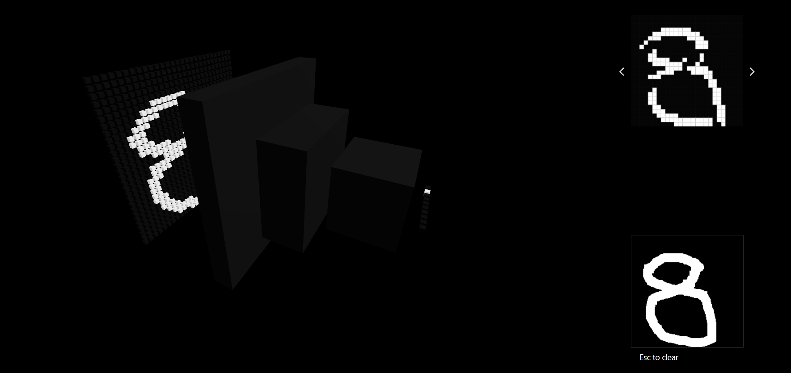

# Visualize CNN

Visualize convolutional neural network on user's inputs

- React Three Fiber for scene render
- Tensorflow.js for model training and inference

CNN version of [visualize-nn](https://github.com/sanahuel/visualize-nn)
